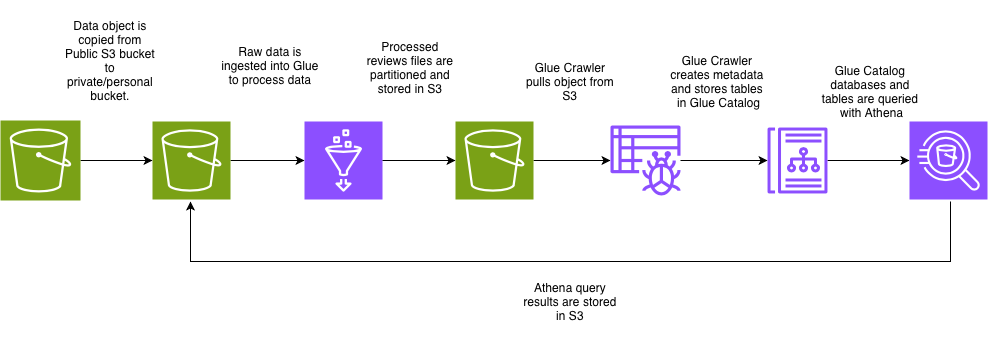

# Amazon Reviews NLP Analytics (AWS S3 | PySpark | Glue  | Athena)

## Overview
This project builds a low-cost, scalable NLP analytics pipeline to analyze Amazon customer reviews using the fast.ai NLP dataset.  
The pipeline ingests raw review data from a public Amazon S3, performs distributed ETL and NLP enrichment with AWS Glue (PySpark), stores curated datasets in S3 as Parquet, and enables serverless analytics using Amazon Athena.

The goal is to demonstrate:
- Cloud-based ETL design
- NLP feature extraction at scale
- Analytics-ready data lake modeling
- Serverless querying without a dedicated warehouse

---

## Dataset
**Source:** [fast.ai NLP datasets ](https://registry.opendata.aws/fast-ai-nlp/) 
**Location:** `s3://fast-ai-nlp/amazon_review_full_csv.tgz`

Each review record contains:
- Rating (1–5)
- title
- Review

The dataset includes millions of Amazon reviews and is commonly used for large-scale NLP tasks.

---

## Architecture



---

## Data Lake Design

### S3 Layout
    ```bash
    amazon_reviews_bucket/
    ├── amazon-reviews-etl/
    │   ├── extracted/
    │   │   ├── train.csv
    │   │   └── test.csv
    │   ├── processed/
    │   │   ├── reviews/
    │   │   │   └── split=train|test/label=1..5/
    │   │   └── summary/
    │   │       ├── top_terms/
    │   │       └── top_phrases/
    │   └── raw/
    │       └── amazon_review_full_csv.tgz
    ├── scripts/
    │   └── glue/
    └── athena-results/
    ```


---

## ETL Pipeline

### Step 1 — Ingestion
- Copy raw `.tgz` file from public S3 to project S3 bucket
- Preserve original file for lineage and reprocessing

### Step 2 — Extraction & Cleaning (AWS Glue / PySpark)
- Extract `train.csv` and `test.csv` from .tgz
- Store extracted CSVs in Project S3
- Parse CSV safely (quoted text, commas) as Spark dataframe
- Remove invalid rows
- Derive:
  - Sentiment classifiers from 'ratings'
  - Review length: Character length of reviews
  - review IDs
  - ingestion date
- Union test and train datasets
- Store clean review data in S3 as parquet

### Step 3 — NLP Enrichment
- Tokenize review text
- Compute:
  - Top terms per sentiment classifier
  - Top phrases per sentiment classifier
- Store aggregated NLP outputs as Parquet

### Step 4 — Catalog & Query
- Register processed datasets in Glue Data Catalog
- Query data using Amazon Athena
- Store query outputs in s3

---